# Master Mindmap & Zotero-Obsidian Citation Network: The Capacity–Latency Resonance Dialectic

```mermaid
graph TD
    %% Central Hub
    HUB["<b>The Floor That Does Not Rise</b><br/><i>Capacity–Latency Resonance Paradox</i><br/>Zenodo: 10.5281/zenodo.21335914"]
    style HUB fill:#1e293b,stroke:#38bdf8,stroke-width:3px,color:#fff

    %% Subgraph: Mathematical Foundations
    subgraph Math_Foundations ["Mathematical & Queueing Foundations"]
        Whitt["<b>Ward Whitt (2002)</b><br/><i>Stochastic-Process Limits</i><br/>Heavy-traffic M_t/G/1 divergence"]
        Kleinrock["<b>Leonard Kleinrock (1975)</b><br/><i>Queueing Systems</i><br/>Workload process V(t)"]
        Massey["<b>William Massey (1985)</b><br/><i>Time-Dependent Queues</i><br/>Non-stationary arrival rates"]
    end
    style Math_Foundations fill:#0f172a,stroke:#3b82f6,stroke-dasharray: 5 5

    %% Subgraph: Economic & Evolutionary Pillars
    subgraph Socio_Econ ["Socio-Economic & Evolutionary Mechanics"]
        Aghion["<b>Aghion & Howitt (1992)</b><br/><i>Creative Destruction</i><br/>Non-equilibrium growth"]
        Hirsch["<b>Fred Hirsch (1977)</b><br/><i>Social Limits to Growth</i><br/>Positional goods & biological privilege"]
        Bostrom["<b>Nick Bostrom (2002)</b><br/><i>Differential Technological Dev.</i><br/>Unilateral acceleration dilemma"]
        VanValen["<b>Leigh Van Valen (1973)</b><br/><i>Red Queen Hypothesis</i><br/>Asymmetric adaptation pressure"]
        Chetty["<b>Chetty et al. (2016) / Cutler (2006)</b><br/><i>Mortality Stratification</i><br/>Income-life expectancy divergence"]
    end
    style Socio_Econ fill:#0f172a,stroke:#10b981,stroke-dasharray: 5 5

    %% Subgraph: Refuted Paradigms (Counter-Theories)
    subgraph Counter_Theories ["Refuted Counter-Paradigms & Fallacies"]
        Rogers["<b>Rogers (2003) & Berwick (2003)</b><br/><i>Diffusion Convergence Fallacy</i><br/>Universal S-curve democratization"]
        Kurzweil["<b>Kurzweil / Diamandis</b><br/><i>The Smartphone Fallacy</i><br/>Moore's Law applied to biology"]
        InSilico["<b>In Silico Trial Techno-Optimists</b><br/><i>Digital Twin Hubris</i><br/>Neural simulation replacing Phase III"]
        Generics["<b>Patent Cliff Theorists</b><br/><i>Generic Commoditization</i><br/>Biosimilars closing the gap"]
    end
    style Counter_Theories fill:#450a0a,stroke:#ef4444,stroke-width:2px

    %% Subgraph: Author's Monograph Series
    subgraph Author_Corpus ["Author's Foundational Research Series (Huynh 2026)"]
        M1["<b>Till Death Tear Us Apart</b><br/><i>Closing Window Framework</i><br/>DOI: 10.5281/zenodo.20777406"]
        M2["<b>The Unfalsifiable Critic</b><br/><i>Epistemic Asymmetry</i><br/>DOI: 10.5281/zenodo.20776160"]
        M3["<b>Biological Zero-Day</b><br/><i>Dynamic Expansion of Death</i><br/>DOI: 10.5281/zenodo.20780733"]
        M4["<b>The Closing Window</b><br/><i>Political Escalation</i><br/>DOI: 10.5281/zenodo.20785465"]
        M5["<b>The Two Biases</b><br/><i>Consumer-Tech Optimism</i><br/>DOI: 10.5281/zenodo.20792546"]
    end
    style Author_Corpus fill:#1e1b4b,stroke:#8b5cf6,stroke-width:2px

    %% Subgraph: Core Claims & Invariants
    subgraph Core_Claims ["Core Theorems & Invariants"]
        T1["<b>CLAIM-T1: Resonance Lock</b><br/>t* = (1/r_A) ln(μ_clin / λ₀) = 7.33 yrs"]
        T2["<b>CLAIM-T2: Workload Divergence</b><br/>W(30) = 594.8 years"]
        T3["<b>CLAIM-T3: Biological Stratification</b><br/>Mortality as an economic variable"]
        T4["<b>CLAIM-T4: Bottleneck Hierarchy</b><br/>μ_eff = min(μ_i) = 1.25/yr"]
        R0["<b>INVARIANT: Rule Zero</b><br/>Raw residual sequence: + + - - - - - - + - + + - + - - + + - +"]
    end
    style Core_Claims fill:#172554,stroke:#06b6d4,stroke-width:2px

    %% Edges: Mathematical Foundations -> HUB
    Whitt -->|"[THEORETICAL | DIRECTLY_SUPPORTED]"| HUB
    Kleinrock -->|"[THEORETICAL | DIRECTLY_SUPPORTED]"| HUB
    Massey -->|"[THEORETICAL | DIRECTLY_SUPPORTED]"| HUB

    %% Edges: Socio-Economic -> HUB
    Aghion -->|"[MECHANISTIC | INFERRED]"| HUB
    Hirsch -->|"[CAUSAL | DIRECTLY_SUPPORTED]"| HUB
    Bostrom -->|"[THEORETICAL | INFERRED]"| HUB
    VanValen -->|"[MECHANISTIC | INFERRED]"| HUB
    Chetty -->|"[CAUSAL | DIRECTLY_SUPPORTED]"| HUB

    %% Edges: Refuted Paradigms -> HUB (Contradictory / Refuted)
    Rogers -.->|"[CONTRADICTORY | REFUTED]"| HUB
    Kurzweil -.->|"[CONTRADICTORY | REFUTED]"| HUB
    InSilico -.->|"[CONTRADICTORY | REFUTED]"| HUB
    Generics -.->|"[CONTRADICTORY | REFUTED]"| HUB

    %% Edges: Author's Monograph Series -> HUB
    M1 ==>|"[FOUNDATIONAL_PILLAR | DIRECTLY_SUPPORTED]"| HUB
    M2 ==>|"[EPISTEMIC_IMMUNIZATION | DIRECTLY_SUPPORTED]"| HUB
    M3 ==>|"[MECHANISTIC_EXTENSION | DIRECTLY_SUPPORTED]"| HUB
    M4 ==>|"[POLITICAL_ECONOMY | DIRECTLY_SUPPORTED]"| HUB
    M5 ==>|"[COGNITIVE_BIAS_AUDIT | DIRECTLY_SUPPORTED]"| HUB

    %% Edges: HUB -> Core Claims
    HUB -->|"[PROVES | DIRECTLY_SUPPORTED]"| T1
    HUB -->|"[PROVES | DIRECTLY_SUPPORTED]"| T2
    HUB -->|"[PROVES | DIRECTLY_SUPPORTED]"| T3
    HUB -->|"[PROVES | DIRECTLY_SUPPORTED]"| T4
    HUB -->|"[ENFORCES | DIRECTLY_SUPPORTED]"| R0
```

---

## 🧭 Topological Knowledge Graph Index

### 1. Thinkers & Theoretical Paradigms
- [[Whitt_Ward_Queueing_Limits|Ward Whitt (2002)]] — Heavy-traffic limits, non-stationary queue lengths, and backlog divergence.
- [[Kleinrock_Massey_Time_Dependent|Leonard Kleinrock (1975) & William Massey (1985)]] — The workload process $V(t)$ and time-dependent Poisson arrivals.
- [[Rogers_Berwick_Diffusion_Fallacy|Everett Rogers (2003) & Donald Berwick (2003)]] — **[REFUTED]** The Neoclassical Diffusion Convergence Fallacy.
- [[Kurzweil_Smartphone_Fallacy|Ray Kurzweil & Peter Diamandis]] — **[REFUTED]** The Smartphone Fallacy (confusing silicon scaling with biological observation).
- [[Aghion_Howitt_Creative_Destruction|Philippe Aghion & Peter Howitt (1992)]] — Creative destruction and non-equilibrium growth.
- [[Hirsch_Fred_Positional_Limits|Fred Hirsch (1977)]] — Social limits to growth, positional goods, and biological privilege.
- [[Bostrom_Nick_Differential_Tech|Nick Bostrom (2002)]] — Differential technological development and the unilateral acceleration dilemma.
- [[Van_Valen_Red_Queen|Leigh Van Valen (1973)]] — The Red Queen hypothesis adapted to asymmetric technological competition.
- [[Chetty_Cutler_Mortality_Inequality|Raj Chetty (2016) & David Cutler (2006)]] — Empirical documentation of income-stratified mortality divergence.
- [[InSilico_Trialists_Epistemic_Hubris|In Silico Trialists & Digital Twin Proponents]] — **[REFUTED]** The fallacy that neural simulation replaces physical human longitudinal trials.

### 2. Author's Foundational Monograph Series (Gia Bao Huynh 2026)
- [[Huynh_2026_Till_Death_Tear_Us_Apart|Till Death Tear Us Apart: A Structural Analysis of the Longevity Asymmetry]] — Zotero: `GI2ASFMG` · DOI: `10.5281/zenodo.20777406`
- [[Huynh_2026_Unfalsifiable_Critic|The Unfalsifiable Critic: Prospective Immunization and Epistemic Asymmetry]] — Zotero: `TDKDGZHA` · DOI: `10.5281/zenodo.20776160`
- [[Huynh_2026_Biological_Zero_Day|The Biological Zero-Day Mechanism: Reclassification & Preventable Death]] — Zotero: `EIKTRBGH` · DOI: `10.5281/zenodo.20780733`
- [[Huynh_2026_Closing_Window|The Closing Window: Structural Conditions for Political Escalation]] — Zotero: `FFWLB6YX` · DOI: `10.5281/zenodo.20785465`
- [[Huynh_2026_Two_Biases|The Two Biases That Blind Governance: Consumer Optimism & Therapeutic Reasoning]] — Zotero: `GUNS4C6I` · DOI: `10.5281/zenodo.20792546`
- [[Huynh_2026_Floor_That_Does_Not_Rise|The Floor That Does Not Rise: Mathematical Proof & Five-Domain Audit]] — Zenodo DOI: `10.5281/zenodo.21335914`

### 3. Core Theorems, Claims & Invariants
- [[CLAIM_T1_Resonance_Lock_Threshold|CLAIM-T1]]: Critical transition threshold $t^* = 7.33	ext{ years}$ where $
ho(t) \ge 1.0$.
- [[CLAIM_T2_Workload_Divergence|CLAIM-T2]]: Workload divergence $W(30) = 594.8	ext{ years}$ under heavy-traffic queueing.
- [[CLAIM_T3_Biological_Stratification|CLAIM-T3]]: Mortality transitions from a biological invariant to an economic variable.
- [[CLAIM_T4_Bottleneck_Hierarchy|CLAIM-T4]]: Serial bottleneck theorem $\mu_{\text{eff}} = \min(\mu_i) = 1.25/\text{year}$.
- [[INVARIANT_Rule_Zero_Raw_Residuals|INVARIANT-R0]]: Rule Zero enforcement of the exact raw residual sign sequence `+ + - - - - - - + - + + - + - - + + - +`.
