# ERI Master Mindmap & Dialectic Citation Network (NotebookLM Grounded)

> [!IMPORTANT]
> **RULE ZERO (SUPREME DIRECTIVE)**: The locked $N=6$ fsQCA baseline table and truth-table solution (`Collapse = (O * M) + (M * ~B)` at consistency=0.75, coverage=0.75) must NEVER be altered, smoothed, or re-coded silently. Tang Dynasty citation MUST be **Dardess (1973) *Conquerors and Confucians*** (NOT 1994). Direct Sovereign Override ($O$) alone is *insufficient* for institutional collapse; Mediation Structure ($M$) is the necessary nexus.

```mermaid
graph TD
    subgraph ERI_3Vol ["ERI Three-Volume Architecture (Yale University Press)"]
        VOL1["Volume I: The Infrastructure of Borrowed Legitimacy<br/>Direct vs Indirect Rule & Customary Court Legacy (r = -0.83)"]
        VOL2["Volume II: Mediation Networks & The Anatomy of Collapse<br/>The Locked N=6 Baseline & Expanded N=24 Fatal Triad"]
        VOL3["Volume III: Entropy-Resistant Institutions (ERI Construct)<br/>Substrate Independence & The 6 Structural Attributes"]
    end

    subgraph ERI_Key_Mechanisms ["Key Formal Frameworks & Findings"]
        F1["Locked N=6 fsQCA Baseline<br/>Collapse = (O * M) + (M * ~B)"]
        F2["Expanded N=24 Fatal Triad<br/>NRI * HVF * CIS -> Breakdown (Cons=1.0)"]
        F3["ERII Index & The Ranking Flip<br/>Endurance vs. Disruption Density Weighting"]
        F4["The Jiankang Graft Model<br/>Building Substrate Before Institutional Apparatus"]
        F5["The Consociational Arbitrator Trap<br/>International Protectorate Stagnation (Bosnia/Kosovo)"]
    end

    subgraph Foundational_Thinkers ["Foundational Thinkers (Contributed)"]
        DARDESS["John W. Dardess (1973)<br/>Conquerors & Confucians<br/>[TANG_BASELINE | ACCEPTED]"]
        CHITTICK["Andrew Chittick (2020)<br/>The Jiankang Empire<br/>[JIANKANG_GRAFT | ACCEPTED]"]
        TAYLOR["Keith Weller Taylor (1983)<br/>The Birth of Vietnam<br/>[SINITIC_TRANSMISSION | ACCEPTED]"]
        DOWER["John W. Dower (1999)<br/>Embracing Defeat (SCAP Japan)<br/>[BUREAUCRATIC_INERTIA | ACCEPTED]"]
        PERKINS["Kenneth Perkins (2004)<br/>A History of Modern Tunisia<br/>[PROTECTORATE_DYNAMICS | ACCEPTED]"]
        LUGARD["Lord Frederick Lugard (1922)<br/>Dual Mandate in British Africa<br/>[INDIRECT_RULE_ARCHIVE | ACCEPTED]"]
        HECHTER["Michael Hechter (2013)<br/>Alien Rule (Rational Choice)<br/>[MONITORING_COSTS | ACCEPTED]"]
        OSTROM["Elinor Ostrom (1990)<br/>Governing the Commons<br/>[LEGITIMACY_AS_COMMONS | EXTENDED]"]
        LANGE["Matthew Lange (2004/2009)<br/>Lineages of Despotism<br/>[CUSTOMARY_COURT_DATA | ACCEPTED]"]
        NWW["North, Wallis, & Weingast (2009)<br/>Violence & Social Orders<br/>[LIMITED_ACCESS_ORDERS | EXTENDED]"]
        RAGIN["Charles C. Ragin (1987/2000)<br/>Fuzzy-Set Social Science<br/>[FSQCA_METHODOLOGY | ACCEPTED]"]
    end

    subgraph Countered_Thinkers ["Contrasted & Refuted Thinkers (Countered)"]
        ACEMOGLU["Acemoglu & Robinson (2012)<br/>Why Nations Fail<br/>[REFUTED: Crude Inclusive/Extractive Binary]"]
        LIPSET["Seymour Martin Lipset (1959)<br/>Modernization Theory<br/>[REFUTED: Ignores Institutional Entropy dS/dt]"]
        HUNTINGTON_FUKUYAMA["Huntington (1968) & Fukuyama (2011)<br/>Political Order & Decay<br/>[EXTENDED: Consociational Arbitrator Trap]"]
    end

    %% Dialectic Links
    VOL1 --> LANGE
    VOL1 --> HECHTER
    VOL1 --> LUGARD
    VOL2 --> F1
    VOL2 --> F2
    VOL2 --> DARDESS
    VOL2 --> DOWER
    VOL2 --> PERKINS
    VOL2 --> RAGIN
    VOL3 --> F3
    VOL3 --> F4
    VOL3 --> F5
    VOL3 --> CHITTICK
    VOL3 --> OSTROM
    VOL3 --> NWW

    ACEMOGLU -.->|"[ REFUTED_BY_ERI | SUBSTRATE_DEPTH_IGNORED ]"| VOL1
    LIPSET -.->|"[ FALSIFIED_BY_ERI | ENTROPY_DECAY ]"| VOL2
    HUNTINGTON_FUKUYAMA -.->|"[ EXTENDED_BY_ERI | PROTECTORATE_HOLLOWING ]"| F5
```

---

## 1. The Three-Volume Architecture (Summary from NotebookLM)

### Volume I: The Infrastructure of Borrowed Legitimacy
- **Central Query**: How do institutions survive the departure of their creators, and why does bureaucratic capacity vary so drastically across postcolonial states?
- **Core Empirical Finding**: Bureaucratic capacity is an inherited artifact of the colonial legal substrate.
  - Where colonizers built uniform, state-centered legal hierarchies through **Direct Rule** (e.g. Mauritius, Barbados, Singapore), they bequeathed impersonal administrative machinery that endured.
  - Where colonizers relied on **Indirect Rule** by preserving and manipulating traditional chiefdoms and customary tribunals (e.g. Northern Nigeria, Sierra Leone, Uganda), they institutionalized "bifurcated despotisms" that crippled postcolonial state capacity.
- **Statistical Benchmark**: Replicating Matthew Lange's dataset ($N=33$) alongside an original pilot ($N=18$), the analysis yields a robust negative correlation ($r = -0.83, R^2 = 0.69$) between the customary court ratio and postcolonial bureaucratic effectiveness.

### Volume II: Mediation Networks & The Anatomy of Collapse
- **Central Query**: What constitutes the tipping point between controlled institutional stress and irreversible procedural unraveling during governance transitions or imperial exits?
- **Core Theoretical Finding**: Direct Sovereign Override ($O$) is *insufficient* for clean institutional collapse. Sovereign decree without mediation transmission produces friction, evasion, and bureaucratic inertia. Collapse occurs specifically when mediation channels ($M$) either defect or become brittle conduits for unbuffered shocks.
- **The Locked $N=6$ fsQCA Baseline**:
  $$\text{Collapse} = (O \cdot M) + (M \cdot \sim B) \quad [\text{Consistency: 0.75, Coverage: 0.75}]$$
- **The Expanded $N=24$ csQCA Truth Table**:
  - **The Fatal Triad**: $\text{NRI} \times \text{HVF} \times \text{CIS} \to \text{Breakdown}$ (Consistency = 1.0000, Coverage = 0.6923). Explains 69.2% of post-transition breakdowns across world history (Roman Judaea, Mauretania, Kashmir 1947, Hyderabad 1948, Biafra/Nigeria 1960, Mengo Palace/Uganda 1966).
  - **The Smooth Exit Path**: $\text{NRI} \times \sim\text{HVF} \times \sim\text{CIS} \to \text{Peaceful Exit}$ (Consistency = 1.0000) across 7 cases (SCAP Japan, UNTAC Cambodia, Commagene, Nabataea).

### Volume III: Entropy-Resistant Institutions (The ERI Construct)
- **Central Query**: How can human and automated governance institutions be engineered to maintain dynamic equilibrium across multi-generational horizons?
- **The ERI Triad**:
  1. *Substrate Independence*: Institutional memory and procedural validity must not reside in individual human charisma or single-vendor digital platforms.
  2. *Asynchronous Zero-Trust Auditability*: Continuous verification of executive actions against constitutional invariants.
  3. *Elastic Mediation Buffers*: Built-in latency buffers that prevent high-frequency external disruptions from destabilizing deliberative governance.
- **The 6 Structural Attributes of ERI** (Extracted from Jiankang Empire 220–589 CE, Japanese Imperial House c. 500–present, and the Holy See c. 33–present):
  1. *Decoupling of Legitimating Authority from Executive Power*: Ceding daily executive control to preserve the overarching legitimating function.
  2. *Succession Independent of Biological Lineage*: Institutionalized selection mechanisms (e.g. Papal Conclave) immune to dynastic extinction.
  3. *Universalist Claims Transcending Territory*: Legitimating principles not coextensive with physical borders.
  4. *Absorption Capacity for External Actors*: Ability to absorb successive waves of conquerors or paradigm shifts without losing core identity.
  5. *Productive Ambiguity of Institutional Role*: Strategic role fluidity preventing efficient targeting by hostile actors.
  6. *Output-Leadership Separation*: Primary institutional output carried by the office rather than the personal qualities of the leader.

---

## 2. The ERII Index & The Ranking Flip
The Entropy-Resistant Institution Index (ERII) reveals a critical property: "entropy resistance" bundles two un-correlated properties:
- **Formula A (Endurance-weighted)**: Ranks Holy See (0.90) > Japan (0.50) > Jiankang (0.15).
- **Formula B (Density-weighted)**: Ranks Jiankang (0.60) > Holy See (0.49) > Japan (0.15).
- **The Density Gap**: Historical disruption density ($\delta$) mapped against the formal Biological Zero-Day Mechanism ($\lambda_{\text{bz}} \approx 0.5/\text{year}$, or ~50 disruptions/century). The highest historical survivor (Jiankang, $\delta = 1.36$) is 37 times lower than $\lambda_{\text{bz}}$, proving that historical ERI templates are tested far below projected F2 biopolitics demand.

---

## 3. Thinker Dialectic Matrix (NotebookLM Grounded)

| Thinker & Work | Core Contribution to ERI | ERI Dialectic Critique / Extension |
| :--- | :--- | :--- |
| **Michael Hechter (2013)** *Alien Rule* | Rational choice microfoundations: monitoring costs, agency slack, subordinate despotism. | Explains why indirect rule creates unbridgeable agency slack in postcolonial bureaucracies. |
| **Elinor Ostrom (1990)** *Governing the Commons* | 8 Design Principles for common-pool resource management. | Mapped Ostrom's 8 principles onto political authority and legitimacy as an institutional common-pool resource. |
| **North, Wallis, & Weingast (2009)** *Violence and Social Orders* | Limited Access Orders (Natural States) and elite rent-creation matrices. | Extended to explain how elite rent-sharing buffers sovereign override until mediation channels calcify. |
| **Andrew Chittick (2020)** *The Jiankang Empire* | The Jiankang Graft Model (building substrate before apparatus). | Demonstrates how the Jiankang administrative substrate survived 300+ years of regime turnover. |
| **Matthew Lange (2004/2009)** *Lineages of Despotism* | Customary court ratio and postcolonial bureaucratic capacity data. | Provided the quantitative dataset ($N=33, r=-0.83$) for Volume I's legal substrate theorem. |
| **Daron Acemoglu & James Robinson (2012)** *Why Nations Fail* | Inclusive vs. extractive institutional dichotomy. | **REFUTED**: Postcolonial capacity depends on structural substrates and administrative depth, not abstract inclusivity (e.g. extractive direct rule in Singapore left high capacity; benign indirect rule in Nigeria left weak capacity). |
| **Samuel Huntington (1968) & Francis Fukuyama (2011)** *Political Order* | Political institutionalization vs. decay. | **EXTENDED**: Formulates the *Consociational Arbitrator Trap* (international protectorates like Bosnia/Kosovo achieving institutionalization without domestic accountability). |
