# ERI Master Mindmap & Dialectic Citation Network

> [!IMPORTANT]
> **RULE ZERO (SUPREME DIRECTIVE)**: The locked $N=6$ fsQCA baseline table and truth-table solution (`Collapse = (O * M) + (M * ~B)` at consistency=0.75, coverage=0.75) must NEVER be altered, smoothed, or re-coded silently. Tang Dynasty citation MUST be **Dardess (1973) *Conquerors and Confucians*** (NOT 1994). Direct Sovereign Override ($O$) alone is *insufficient* for institutional collapse; Mediation Structure ($M$) is the necessary nexus.

```mermaid
graph TD
    subgraph ERI_Core ["ERI Core Architecture (Yale 3-Volume Series)"]
        VOL1["Volume I: Mechanics of Institutional Endurance<br/>Entropy, Mediation, & Boundary Limits"]
        VOL2["Volume II: Comparative fsQCA Calibration<br/>The Locked N=6 Baseline & Empirical Cases"]
        VOL3["Volume III: Architecture of Longevity<br/>Sovereign Limits & Post-Collapse Succession"]
    end

    subgraph Core_Claims ["Core Formal Invariants"]
        CLM1["Claim 1: The Locked N=6 fsQCA Baseline<br/>Collapse = (O * M) + (M * ~B)"]
        CLM2["Claim 2: Sovereign Override Insufficiency<br/>O alone cannot collapse an institution"]
        CLM3["Claim 3: Mediation Elasticity as Necessary Nexus<br/>M failure triggers systemic cascade"]
        CLM4["Claim 4: Institutional Entropy Rate<br/>dS_inst / dt > 0 without active work"]
    end

    subgraph Contributed_Thinkers ["Foundational & Corroborating Thinkers (Contributed)"]
        DARDESS["John W. Dardess (1973)<br/>Conquerors and Confucians<br/>[FOUNDATIONAL_EMPIRICS | ACCEPTED]"]
        DOWER["John W. Dower (1999)<br/>Embracing Defeat<br/>[BUREAUCRATIC_CONTINUITY | ACCEPTED]"]
        PERKINS["Kenneth J. Perkins (2004)<br/>A History of Modern Tunisia<br/>[PROTECTORATE_DYNAMICS | ACCEPTED]"]
        LUGARD["Lord Frederick Lugard (1922)<br/>Dual Mandate in British Tropical Africa<br/>[INDIRECT_RULE_MEDIATION | ACCEPTED]"]
        PERHAM["Margery Perham (1937)<br/>Native Administration in Nigeria<br/>[DECENTRALIZED_INSTABILITY | ACCEPTED]"]
        BURKE["Edmund Burke III (1976)<br/>Prelude to Protectorate in Morocco<br/>[MAKHZEN_RESILIENCE | ACCEPTED]"]
        PENNELL["C.R. Pennell (2000)<br/>Morocco Since 1830<br/>[SHERIFIAN_LEGITIMACY | ACCEPTED]"]
        RAGIN["Charles C. Ragin (2000/2008)<br/>Fuzzy-Set Qualitative Comparative Analysis<br/>[FORMAL_METHODOLOGY | ACCEPTED]"]
        NORTH["Douglass C. North (1990)<br/>Institutions, Institutional Change<br/>[CREDIBLE_COMMITMENT | ACCEPTED]"]
        SKOCPOL["Theda Skocpol (1979)<br/>States and Social Revolutions<br/>[STRUCTURAL_AUTONOMY | ACCEPTED]"]
        WEBER["Max Weber (1922)<br/>Economy and Society<br/>[LEGAL_RATIONAL_BUREAUCRACY | ACCEPTED]"]
    end

    subgraph Countered_Thinkers ["Contrasted & Refuted Thinkers (Countered)"]
        ACEMOGLU["Acemoglu & Robinson (2012)<br/>Why Nations Fail<br/>[CRITIQUED: Crude Binary Institutionalism]"]
        LIPSET["Seymour Martin Lipset (1959)<br/>Modernization Theory<br/>[REFUTED: Linear Democratic Inevitability]"]
        PRIN_AGENT["Crude Principal-Agent Models<br/>Zero-Cost Transmission Assumptions<br/>[REJECTED: Ignores Mediation Friction]"]
    end

    %% Dialectic Edges
    VOL1 --> CLM2
    VOL1 --> CLM4
    VOL2 --> CLM1
    VOL2 --> CLM3
    VOL3 --> CLM2

    DARDESS -->|"[ PROVIDES_TANG_EVIDENCE | ACCEPTED ]"| CLM1
    DOWER -->|"[ PROVIDES_JAPAN_EVIDENCE | ACCEPTED ]"| CLM1
    PERKINS -->|"[ PROVIDES_TUNISIA_EVIDENCE | ACCEPTED ]"| CLM1
    LUGARD -->|"[ PROVIDES_NIGERIA_EVIDENCE | ACCEPTED ]"| CLM1
    BURKE -->|"[ PROVIDES_MOROCCO_EVIDENCE | ACCEPTED ]"| CLM1
    RAGIN -->|"[ PROVIDES_QCA_LOGIC | ACCEPTED ]"| CLM1
    NORTH -->|"[ FOUNDS_COMMITMENT_THEORY | EXTENDED ]"| VOL1
    SKOCPOL -->|"[ PROVIDES_STATE_AUTONOMY | EXTENDED ]"| VOL2
    WEBER -->|"[ DEFINES_BUREAUCRACY | EXTENDED ]"| VOL1

    ACEMOGLU -.->|"[ REFUTED_BY | INSUFFICIENT ]"| CLM3
    LIPSET -.->|"[ FALSIFIED_BY | REJECTED ]"| CLM4
    PRIN_AGENT -.->|"[ OVERTURNED_BY | FRICTIONLESS_FLAW ]"| CLM2

    %% Cross-Project Bridges
    ALRP_BRIDGE["Cross-Project Link: ALRP<br/>Mediation Latency = Capacity-Latency Paradox"]
    CLM3 <==>|"[ FORMAL_ISOMORPHISM | MUTUAL_REINFORCING ]"| ALRP_BRIDGE
```

## The Locked $N=6$ fsQCA Truth Table
| Case | Sovereign Override ($O$) | Mediation Failure ($M$) | Bureaucratic Boundary ($B$) | Institutional Collapse ($Y$) | Historical Citation |
| :--- | :---: | :---: | :---: | :---: | :--- |
| **Tang Dynasty** (Late 9th c.) | 0.5 | 0.5 | 0.8 | 0.5 | Dardess (1973) *Conquerors and Confucians* |
| **Morocco** (19th-20th c. Makhzen) | 0.8 | 0.2 | 0.5 | 0.5 | Burke (1976); Pennell (2000) |
| **Nigeria** (Colonial Indirect Rule) | 0.7 | 0.8 | 0.3 | 0.9 | Lugard (1922); Perham (1937) |
| **Tunisia** (French Protectorate) | 0.6 | 0.7 | 0.4 | 0.8 | Perkins (2004) |
| **Japan** (Meiji & Post-WWII) | 0.2 | 0.1 | 0.9 | 0.1 | Dower (1999) |
| **Comparative Anchor** | 0.4 | 0.5 | 0.6 | 0.3 | Cross-regional Synthetic Baseline |

**Boolean Minimization**:
$$	ext{Collapse} = (O \cdot M) + (M \cdot \sim B)$$
- **Consistency**: 0.75
- **Coverage**: 0.75
- **Crucial Theoretical Insight**: Direct Sovereign Override ($O$) appears in the collapse solution *only in conjunction with Mediation Failure ($M$)*. When $M$ is resilient ($M \le 0.2$), even massive sovereign overreach ($O = 0.8$, Morocco) does NOT produce full institutional collapse ($Y = 0.5$). Conversely, when $M$ is broken ($M \ge 0.7$) and bureaucratic boundaries erode ($\sim B$), collapse is near certain ($Y \ge 0.8$), regardless of the sovereign's intent.
