# The Fact Before the Vote & In the Name of Merit

> [!IMPORTANT]
> **SYNTHESIS THEME**: Power and legitimacy at the boundary. *The Fact Before the Vote* examines the species boundary: how legal precedent, sovereign authority, and democratic voting lag behind de facto power when artificial agency arrives. *In the Name of Merit* examines the institutional boundary: how academic and professional meritocracies construct self-serving evaluative gates to extract epistemic taxes and preserve incumbent hierarchies.

```mermaid
graph TD
    subgraph Fact_Before_Vote ["The Fact Before the Vote (4-Volume Series)"]
        FBV1["Vol I: Bench<br/>A River, a Corporation, a God, and the Human Each One Still Needed"]
        FBV2["Vol II: Lag<br/>Power That Arrived Before Permission"]
        FBV3["Vol III: Vigil<br/>A Funeral Nobody Had to Authorize"]
        FBV4["Vol IV: Ledger<br/>An Asset With an Exit Interview"]
    end

    subgraph In_Name_of_Merit ["In the Name of Merit (6-Volume Academic Politics)"]
        INM1["Vol I: Hundred Schools to One Doctrine"]
        INM2["Vol II: The Master's Apprentice"]
        INM3["Vol III: Just Above the Line"]
        INM4["Vol IV: The Language of the Victors"]
        INM5["Vol V: The Invisible Technician Returns"]
        INM6["Vol VI: The Gate That Moved"]
    end

    subgraph Shared_Thinkers ["Foundational & Counter-Thinkers"]
        SCHMITT["Carl Schmitt (1922)<br/>Political Theology (Sovereign is who decides on the exception)<br/>[SOVEREIGN_EXCEPTION | EXTENDED]"]
        KELSEN["Hans Kelsen (1934)<br/>Pure Theory of Law (Grundnorm)<br/>[LEGAL_POSITIVISM | CRITIQUED]"]
        BOURDIEU["Pierre Bourdieu (1984/1988)<br/>Distinction & Homo Academicus<br/>[CULTURAL_CAPITAL | ACCEPTED]"]
        FOUCAULT["Michel Foucault (1975)<br/>Discipline and Punish<br/>[DISCIPLINARY_POWER | EXTENDED]"]
        SANDEL["Michael J. Sandel (2020)<br/>The Tyranny of Merit<br/>[MERITOCRATIC_HUBRIS | EXTENDED]"]
    end

    %% Connections
    SCHMITT -->|"[ PROVIDES_EXCEPTION_THEORY | EXTENDED ]"| FBV2
    KELSEN -.->|"[ CRITIQUED_BY_FBV | NORMATIVE_CLOSURE_FAILS ]"| FBV1
    BOURDIEU -->|"[ PROVIDES_ACADEMIC_CAPITAL | EXTENDED ]"| INM2
    FOUCAULT -->|"[ PROVIDES_EXAMINATION_TECHNIQUES | EXTENDED ]"| INM6
    SANDEL -->|"[ PROVIDES_MORAL_CRITIQUE | FORMALIZED ]"| INM3
```

## Volumes Summary
### The Fact Before the Vote
- **Premise**: For all of human history, judge and judged shared the same biological species. When AI directs its own development, recognition ceases to be the prerequisite for consequence.

### In the Name of Merit
- **Premise**: Merit is not an objective metric of talent; it is an institutional filter designed to extract epistemic taxes and justify retrospective exclusion.
