# Longevity Asymmetry Corpus (LAC) Master Mindmap & Dialectic Citation Network

> [!IMPORTANT]
> **CORPUS INVARIANT**: Biological longevity intervention does NOT democratize evenly; it induces radical structural, generational, and epistemic asymmetries. The 5 foundational monographs establish the irreversible micro-mechanisms; the Doctrine series translates these into systemic governance theorems.

```mermaid
graph TD
    subgraph LAC_Foundational ["5 Foundational Monographs"]
        M1["Monograph I: Till Death Tear Us Apart<br/>[GI2ASFMG] The Temporal Estate & Contract Dissolution"]
        M2["Monograph II: The Unfalsifiable Critic<br/>[TDKDGZHA] Epistemic Closure & Incumbent Sclerosis"]
        M3["Monograph III: The Biological Zero-Day<br/>[EIKTRBGH] Proprietary Senescence Manipulation"]
        M4["Monograph IV: The Closing Window<br/>[FFWLB6YX] Irreversible First-Mover Asymmetry"]
        M5["Monograph V: The Two Biases<br/>[GUNS4C6I] Present-Cohort & Survivorship Blindness"]
    end

    subgraph LAC_Doctrines ["The Doctrine Series (Formal Mechanisms & Data)"]
        D1["The Calibration Trap<br/>Regulators who alter their own lifespan"]
        D2["The Separation That Doesn't Register<br/>Biological preservation vs social capital velocity"]
        D3["The Third Leg That Never Existed<br/>Deconstructing the tri-partite welfare state"]
        D4["The Unprotected Floor<br/>Ceiling of capability rises while vulnerability floor freezes"]
        D5["The Best Case Already Failed<br/>Historical disproof of egalitarian longevity distribution"]
        D6["When Death Becomes Poverty<br/>Commodification of life expectancy as financial asset"]
    end

    subgraph Contributed_Thinkers ["Foundational & Corroborating Thinkers (Contributed)"]
        MANNHEIM["Karl Mannheim (1928)<br/>The Problem of Generations<br/>[GENERATIONAL_REPLACEMENT | ACCEPTED]"]
        KUHN["Thomas S. Kuhn (1962)<br/>The Structure of Scientific Revolutions<br/>[EPISTEMIC_TURNOVER | ACCEPTED]"]
        PLANCK["Max Planck (1949)<br/>Scientific Autobiography (Planck's Principle)<br/>[FUNERAL_PROGRESSION | ACCEPTED]"]
        SEN["Amartya Sen (1981/1999)<br/>Poverty & Famines / Development as Freedom<br/>[CAPABILITIES_ASYMMETRY | ACCEPTED]"]
        PIKETTY["Thomas Piketty (2013)<br/>Capital in the Twenty-First Century (r > g)<br/>[COMPOUNDING_HORIZONS | ACCEPTED]"]
        RAWLS["John Rawls (1971)<br/>A Theory of Justice (Veil of Ignorance)<br/>[INTERGENERATIONAL_EQUITY | ACCEPTED]"]
    end

    subgraph Countered_Thinkers ["Contrasted & Refuted Thinkers (Countered)"]
        DEGREY["Aubrey de Grey & Biogerontologists<br/>Ending Aging (Longevity Escape Velocity)<br/>[REFUTED: Naive Post-Aging Utopianism]"]
        FUKUYAMA["Francis Fukuyama (2002)<br/>Our Posthuman Future<br/>[CRITIQUED: Biological Essentialism over Game Theory]"]
        MODIGLIANI["Franco Modigliani (1954)<br/>Life-Cycle Hypothesis<br/>[OVERTURNED: Assumptions of Terminal Mortality]"]
    end

    %% Dialectic Connections
    MANNHEIM -->|"[ PROVIDES_GENERATIONAL_MECHANIC | ACCEPTED ]"| M1
    KUHN -->|"[ PROVIDES_PARADIGM_SCLEROSIS | ACCEPTED ]"| M2
    PLANCK -->|"[ PROVIDES_PLANCK_PRINCIPLE | ACCEPTED ]"| M2
    PIKETTY -->|"[ PROVIDES_CAPITAL_HORIZON | EXTENDED ]"| M1
    SEN -->|"[ PROVIDES_ENTITLEMENT_FRAME | EXTENDED ]"| D4
    RAWLS -->|"[ FOUNDS_VEIL_OF_IGNORANCE | EXTENDED ]"| D3

    DEGREY -.->|"[ REFUTED_BY_LAC | IGNORES_POWER_ASYMMETRY ]"| M3
    DEGREY -.->|"[ REFUTED_BY_LAC | NAIVE_DIFFUSION ]"| D5
    FUKUYAMA -.->|"[ CRITIQUED_BY_LAC | MORALISTIC_BLINDSPOT ]"| M4
    MODIGLIANI -.->|"[ FALSIFIED_BY_LAC | TERMINAL_ASSUMPTION_BROKEN ]"| D6

    %% Cross-Project Connections
    M4 <==>|"[ CROSS_PROJECT_BRIDGE | THE_FLOOR_THAT_DOES_NOT_RISE ]"| D4
```

## Foundational Monograph Codes
- **Monograph I**: *Till Death Tear Us Apart* (`GI2ASFMG`)
- **Monograph II**: *The Unfalsifiable Critic* (`TDKDGZHA`)
- **Monograph III**: *The Biological Zero-Day Mechanism* (`EIKTRBGH`)
- **Monograph IV**: *The Closing Window* (`FFWLB6YX`)
- **Monograph V**: *The Two Biases That Blind Governance* (`GUNS4C6I`)
