```mermaid
graph TD
    subgraph LAC_Foundational_Monographs ["5 Foundational Monographs"]
        M1["Monograph I: Till Death Tear Us Apart<br/>[GI2ASFMG] The Temporal Estate & Contract Dissolution"]
        M2["Monograph II: The Unfalsifiable Critic<br/>[TDKDGZHA] Epistemic Closure & Incumbent Sclerosis"]
        M3["Monograph III: The Biological Zero-Day Mechanism<br/>[EIKTRBGH] Proprietary Senescence Coercion"]
        M4["Monograph IV: The Closing Window<br/>[FFWLB6YX] Irreversible First-Mover Asymmetry"]
        M5["Monograph V: The Two Biases<br/>[GUNS4C6I] Present-Cohort & Survivorship Blindness"]
    end

    subgraph Core_Mechanisms ["Core Formal & Neurobiological Invariants"]
        A5["A5 / Kin Attachment Threat Vector<br/>dACC survival hardwiring; un-habituating threat"]
        SW["The Symmetric Wound<br/>Regulators cannot recuse their own mortal kin"]
        ALRP_LEMMA["The Impossibility Lemma<br/>ARSI Acceleration Trap & Queueing Instability (rho > 1)"]
        F2_GOV["F2: Preemptive International AI Governance<br/>Global public good binding before enclave visibility"]
    end

    subgraph Literature_Integration ["Imported Theoretical Traditions (NotebookLM Grounded)"]
        TALEB["Nassim Nicholas Taleb (2018)<br/>Skin in the Game<br/>[ASYMMETRIC_RISK_EXPOSURE | ACCEPTED]"]
        HARDWIG["John Hardwig (1985)<br/>Epistemic Dependence<br/>[TRUST_AT_SCALE | ACCEPTED]"]
        KITCHER["Philip Kitcher (1990)<br/>Division of Cognitive Labor<br/>[EPISTEMIC_DIVISION | EXTENDED]"]
        MANNHEIM["Karl Mannheim (1928)<br/>Problem of Generations<br/>[GENERATIONAL_REPLACEMENT | ACCEPTED]"]
        KUHN_PLANCK["Kuhn & Planck (1962/1949)<br/>Planck's Principle<br/>[PARADIGM_SCLEROSIS | ACCEPTED]"]
        PIKETTY["Thomas Piketty (2013)<br/>Capital in the 21st Century (r > g)<br/>[COMPOUNDING_HORIZONS | ACCEPTED]"]
        SEN["Amartya Sen (1981/2009)<br/>Capabilities & The Idea of Justice<br/>[ENTITLEMENT_VECTOR | EXTENDED]"]
        HODGSON["Geoffrey Hodgson & Knudsen (2010)<br/>Darwin's Conjecture<br/>[INSTITUTIONAL_EVOLUTION | ACCEPTED]"]
    end

    subgraph Countered_Thinkers ["Contrasted & Refuted Thinkers (Countered)"]
        DEGREY["Aubrey de Grey (2007)<br/>Ending Aging (Longevity Escape Velocity)<br/>[REFUTED: Ignores Enclave Capital & Asymmetry Trap]"]
        FUKUYAMA["Francis Fukuyama (2002)<br/>Our Posthuman Future<br/>[CRITIQUED: Replaced Essentialism with Game Theory]"]
        MODIGLIANI["Franco Modigliani (1954)<br/>Life-Cycle Hypothesis<br/>[OVERTURNED: Terminal Mortality Assumption Broken]"]
    end

    %% Connections
    M3 --> A5
    M3 --> SW
    M4 --> ALRP_LEMMA
    ALRP_LEMMA --> F2_GOV
    A5 --> F2_GOV

    TALEB -->|"[ PROVIDES_ASYMMETRY_LOGIC | ACCEPTED ]"| SW
    HARDWIG -->|"[ PROVIDES_EPISTEMIC_TRUST | EXTENDED ]"| M2
    KITCHER -->|"[ PROVIDES_COGNITIVE_LABOR | EXTENDED ]"| M2
    MANNHEIM -->|"[ PROVIDES_GENERATIONAL_MECHANIC | ACCEPTED ]"| M1
    KUHN_PLANCK -->|"[ PROVIDES_GATEKEEPER_IMMORTALITY | ACCEPTED ]"| M2
    PIKETTY -->|"[ PROVIDES_CAPITAL_HORIZON | EXTENDED ]"| M1
    SEN -->|"[ PROVIDES_ENTITLEMENT_FRAME | EXTENDED ]"| F2_GOV

    DEGREY -.->|"[ REFUTED_BY_LAC | NAIVE_DIFFUSION_REJECTED ]"| ALRP_LEMMA
    FUKUYAMA -.->|"[ CRITIQUED_BY_LAC | ESSENTIALISM_REJECTED ]"| M4
    MODIGLIANI -.->|"[ FALSIFIED_BY_LAC | TERMINAL_MORTALITY_BROKEN ]"| M1
```

# Longevity Asymmetry Corpus (LAC) Master Mindmap (NotebookLM Grounded)

> [!IMPORTANT]
> **THE IMPOSSIBILITY LEMMA**: Market forces and democratic deliberation *cannot* resolve biological longevity asymmetry post-hoc. AI Recursive Self-Improvement (ARSI) is required to lower biological manufacturing costs, but ARSI continuously resets discovery ($F(t)$) faster than clinical diffusion ($\mu$) can cross the hard biological floor ($
ho > 1$). The resulting gap triggers **A5 Kin Attachment Threat Vectors** (dACC survival pathways), generating un-habituating retributive political mobilization.

---

## 1. The Impossibility Lemma & The ARSI-Longevity Resonance Paradox
- **The Acceleration Trap**: The only generative engine capable of driving biological discovery costs down to democratize access is **AI Recursive Self-Improvement (ARSI)**.
- **The Continuous Reset**: Every advance in ARSI triggers fresh discovery events ($F(t)$) faster than clinical validation and biomanufacturing ($D(t)$) can diffuse previous breakthroughs across the general population.
- **Queueing Instability ($
ho > 1$)**:
  $$
ho(t) = rac{\lambda(t) \cdot \mathbb{E}[\delta]}{\mu} > 1$$
  Because clinical validation requires invariant biological time in living organisms (a **hard floor**), service capacity $\mu$ is bounded while arrival rate $\lambda(t)$ compounds exponentially. The queue diverges permanently.

---

## 2. The Symmetric Wound & The Governance Paradox
- Traditional public policy assumes an impartial regulator who designs equitable distribution.
- **The Symmetric Wound**: Regulators, central bankers, and legislators are biological human beings with aging parents, spouses, and children.
- **The Catastrophic Conflict of Interest**: A regulator cannot be recused from decisions allocating or delaying life-extension therapies without being asked to exhibit indifferent cruelty toward their own kin—a demand that human neurobiology rejects. Recusal, disclosure, and divestment mechanisms fail completely.

---

## 3. The A5 Kin Attachment Threat Vector
- Neurobiologically hardwired in the dorsal anterior cingulate cortex (dACC) and amygdala survival pathways.
- Unlike economic inequality, humans **cannot habituate** to visible biological stratification. When an out-group achieves biological immortality while one's own children or parents face terminal biological decline, cognition shifts from political negotiation into existential retributive mobilization.

---

## 4. The F2 Preemptive Governance Exit Condition
To avoid catastrophic retributive collapse, **Preemptive International AI Governance (F2)** must be established *before* biological asymmetry becomes socially visible at scale:
1. Treat AI-derived cellular and genetic reprogramming targets as a **global public good**.
2. Allocate compute downstream of discovery to prioritize broad-spectrum, scalable healthspan interventions over bespoke elite protocols.
3. Legally bind private hyperscalers ($725B capital) to universal distribution mandates before enclave capture becomes irreversible.
