# War Correspondent Philosophy: Master Mindmap & Dialectic Citation Network

> [!IMPORTANT]
> **PHILOSOPHICAL INVARIANT**: Philosophy cannot be conducted from an armchair of detached abstraction; the philosopher must act as an **Embedded Witness**, incurring personal epistemic and existential risk. Research output must be **Self-Demonstrating**, timestamped, and exposed to independent falsification attack surfaces.

```mermaid
graph TD
    subgraph WCP_Volumes ["6-Volume Complete Series (Zenodo DOI: 10.5281/zenodo.22822036)"]
        V1["Vol I: The Embedded Witness<br/>Temporal Proximity, Designed Absence, & Self-Demonstrating Text"]
        V2["Vol II: Falsification & Epistemic Self-Governance<br/>Popper, Independent Attack Surfaces, & Self-Sealing Drift"]
        V3["Vol III: Corpus Temporalism<br/>Timestamp as Argument & Sequence as Evidential Weight"]
        V4["Vol IV: Human-AI Epistemology<br/>Statelessness, Machine-Speed Division of Labor, & Mechanical Condition"]
        V5["Vol V: Mechanism Transfer & Domain Portability<br/>Formal Structures Surviving Cross-Domain Transit"]
        V6["Vol VI: The Prospective & Self-Revising Life<br/>What a Theory Does After It Is Falsified"]
    end

    subgraph Contributed_Thinkers ["Foundational & Corroborating Thinkers (Contributed)"]
        POPPER["Karl R. Popper (1934/1959)<br/>The Logic of Scientific Discovery<br/>[FALSIFICATIONISM | FOUNDATIONAL]"]
        GADAMER["Hans-Georg Gadamer (1960)<br/>Truth and Method (Wirkungsgeschichte)<br/>[TEMPORAL_HORIZONS | ACCEPTED]"]
        RICOEUR["Paul Ricoeur (1983-1985)<br/>Time and Narrative & Memory, History, Forgetting<br/>[HISTORICAL_TESTIMONY | ACCEPTED]"]
        BENJAMIN["Walter Benjamin (1936)<br/>The Storyteller & Angel of History<br/>[WITNESS_AS_STORYTELLER | ACCEPTED]"]
        POLANYI["Michael Polanyi (1958)<br/>Personal Knowledge<br/>[TACIT_COMMITMENT | ACCEPTED]"]
    end

    subgraph Countered_Thinkers ["Contrasted & Refuted Thinkers (Countered)"]
        CARNAP["Rudolf Carnap & Logical Positivists<br/>Verificationism & Protocol Sentences<br/>[REFUTED: Context-Free Empiricism]"]
        BAUDRILLARD["Jean Baudrillard (1981)<br/>Simulacra and Simulation<br/>[CRITIQUED: Hyperreal Nihilism Denying the Ground Witness]"]
        TECHNO_OPTIMISTS["Silicon Valley AI Autonomy Evangelists<br/>Autonomous Agency without Epistemic Anchor<br/>[REJECTED: Erases Human Epistemic Liability]"]
    end

    %% Dialectic Connections
    POPPER -->|"[ PROVIDES_ATTACK_SURFACE | EXTENDED ]"| V2
    GADAMER -->|"[ PROVIDES_TEMPORAL_DISTANCE | EXTENDED ]"| V3
    RICOEUR -->|"[ PROVIDES_TESTIMONIAL_ETHICS | ACCEPTED ]"| V1
    BENJAMIN -->|"[ PROVIDES_GROUNDED_WITNESS | ACCEPTED ]"| V1
    POLANYI -->|"[ PROVIDES_PERSONAL_KNOWLEDGE | ACCEPTED ]"| V4

    CARNAP -.->|"[ REFUTED_BY_WCP | PROTOCOL_SENTENCES_FAIL ]"| V2
    BAUDRILLARD -.->|"[ OVERTURNED_BY_WCP | STUBBORN_GROUND_TRUTH ]"| V1
    TECHNO_OPTIMISTS -.->|"[ REJECTED_BY_WCP | MACHINE_SPEED_AMNESIA ]"| V4

    %% Cross-Project Connections
    V4 <==>|"[ EPISTEMIC_ANCHOR | ALL_PROJECTS ]"| ERI_LAC_ALRP["Meta-Epistemic Core for ERI, LAC, & ALRP"]
```

## Complete Edition Zenodo Record
- **DOI**: [10.5281/zenodo.22822036](https://doi.org/10.5281/zenodo.22822036)
- **License**: Creative Commons Attribution 4.0 International (CC-BY-4.0)
- **Author**: Gia Bao Huynh (Jun Huynh)
- **PhilPapers Taxonomy**: Philosophy of Science, Epistemology, Human-AI Interaction.
