# War Correspondent Philosophy: Master Mindmap (NotebookLM Grounded)

> [!IMPORTANT]
> **PHILOSOPHICAL INVARIANT**: Philosophy cannot be conducted from an armchair of detached abstraction. The researcher is an **Embedded Witness** who incurs epistemic liability, enforces **Corpus Temporalism** (timestamp as argument), and bridges **Human–AI Epistemic Dependence** at machine speed while bearing the moral weight of the ground truth.

```mermaid
graph TD
    subgraph WCP_6Volumes ["Complete 6-Volume Series (Zenodo DOI: 10.5281/zenodo.22822036)"]
        V1["Vol I: The Embedded Witness<br/>Temporal Proximity, Designed Absence, & Self-Demonstrating Text"]
        V2["Vol II: Falsification & Epistemic Self-Governance<br/>Popper, Independent Attack Surfaces, & Self-Sealing Drift"]
        V3["Vol III: Corpus Temporalism<br/>Timestamp as Argument & Sequence as Evidential Weight"]
        V4["Vol IV: Human–AI Epistemology<br/>Statelessness, Machine-Speed Division of Labor, & Mechanical Condition"]
        V5["Vol V: Mechanism Transfer & Domain Portability<br/>Formal Structures Surviving Cross-Domain Transit"]
        V6["Vol VI: The Prospective & Self-Revising Life<br/>What a Theory Does After It Is Falsified"]
    end

    subgraph Literature_Canon ["27-Source Literature Canon (NotebookLM Grounded)"]
        POPPER["Karl R. Popper (1959/1963)<br/>Logic of Scientific Discovery & Conjectures<br/>[FALSIFICATIONISM | FOUNDATIONAL]"]
        LAKATOS["Imre Lakatos (1970)<br/>Methodology of Scientific Research Programmes<br/>[RESEARCH_PROGRAMMES | ACCEPTED]"]
        REICHENBACH["Hans Reichenbach (1938)<br/>Experience and Prediction<br/>[DISCOVERY_VS_JUSTIFICATION | ACCEPTED]"]
        MERTON["Robert K. Merton (1957)<br/>Priority in Scientific Discovery<br/>[PRIORITY_AND_TIMESTAMPS | ACCEPTED]"]
        HULL["David L. Hull (1988)<br/>Science as a Process (Replicators & Interactors)<br/>[EVOLUTIONARY_EPISTEMOLOGY | ACCEPTED]"]
        HARDWIG_KITCHER["Hardwig (1985) & Kitcher (1990)<br/>Epistemic Dependence & Cognitive Labor<br/>[MACHINE_SPEED_DEPENDENCE | EXTENDED]"]
        ARENDT["Hannah Arendt (1963)<br/>Eichmann in Jerusalem (Banality of Evil)<br/>[BUREAUCRATIC_EVIL | EXTENDED]"]
        FANON["Frantz Fanon (1961)<br/>The Wretched of the Earth<br/>[DECOLONIAL_RESISTANCE | ACCEPTED]"]
        WEIL["Simone Weil (1940)<br/>The Iliad, or the Poem of Force<br/>[FORCE_AND_VULNERABILITY | ACCEPTED]"]
        DOYLE["Arthur Conan Doyle (1890)<br/>The Sign of the Four<br/>[HOLMESIAN_ELIMINATION | ACCEPTED]"]
        BAI_ANTHROPIC["Yuntao Bai et al. (Anthropic, 2022)<br/>Constitutional AI (RLAIF)<br/>[CONSTITUTIONAL_MECHANISM | ACCEPTED]"]
    end

    subgraph Countered_Traditions ["Contrasted & Refuted Traditions"]
        CARNAP["Rudolf Carnap (1928/1936)<br/>Protocol Sentences<br/>[REFUTED: Context-Free Empiricism]"]
        BAUDRILLARD["Jean Baudrillard (1981)<br/>Simulacra and Simulation<br/>[CRITIQUED: Nihilistic Hyperreality Denying the Ground Witness]"]
        SILICON_VALLEY["Silicon Valley AI Autonomy Evangelists<br/>Autonomous Agency without Epistemic Liability<br/>[REJECTED: Machine-Speed Amnesia]"]
    end

    %% Dialectic Links
    V1 --> WEIL
    V1 --> FANON
    V2 --> POPPER
    V2 --> LAKATOS
    V2 --> DOYLE
    V3 --> MERTON
    V3 --> REICHENBACH
    V4 --> HARDWIG_KITCHER
    V4 --> BAI_ANTHROPIC
    V5 --> HULL
    V6 --> POPPER

    CARNAP -.->|"[ REFUTED_BY_WCP | RAW_PROTOCOLS_FAIL ]"| V2
    BAUDRILLARD -.->|"[ CRITIQUED_BY_WCP | STUBBORN_GROUND_TRUTH ]"| V1
    SILICON_VALLEY -.->|"[ REJECTED_BY_WCP | HUMAN_ANCHOR_REQUIRED ]"| V4
```

---

## 1. Key Foundational Concepts from NotebookLM

### The Embedded Witness (Volume I)
- Grounded in Simone Weil's *Poem of Force* and Walter Benjamin's *The Storyteller*: the philosopher cannot evaluate power from a sanitized distance.
- The witness is subject to the same force that governs the subjects under study, providing the testimonial legitimacy that sterile mathematical abstraction lacks.

### Falsification and Epistemic Self-Governance (Volume II)
- Combines Karl Popper's critical rationalism, Imre Lakatos's research programmes, and Arthur Conan Doyle's Holmesian method ("When you have eliminated the impossible, whatever remains, however improbable, must be the truth").
- A living theory must construct its own independent attack surfaces to detect and terminate its own self-sealing tendencies before external critics do.

### Corpus Temporalism: Timestamp as Argument (Volume III)
- Grounded in Robert K. Merton's *Priority in Scientific Discovery* and Hans Reichenbach's *Experience and Prediction*.
- Evidential weight is inseparable from sequence: pre-registered, cryptographically hashed timestamps demonstrate whether a claim was a risky prospective prediction or post-hoc curve-fitting.

### Human–AI Epistemology & Epistemic Dependence at Machine Speed (Volume IV)
- Extends Philip Kitcher's *Division of Cognitive Labor* (1990) and John Hardwig's *Epistemic Dependence* (1985) into human-AI research interaction.
- **The Mechanical Condition & Statelessness**: Large language models operate without native episodic memory between sessions (statelessness). They execute cognitive tasks at machine speed, but cannot bear epistemic liability. The human researcher must serve as the biological anchor who assumes legal, moral, and epistemological responsibility for the output.
